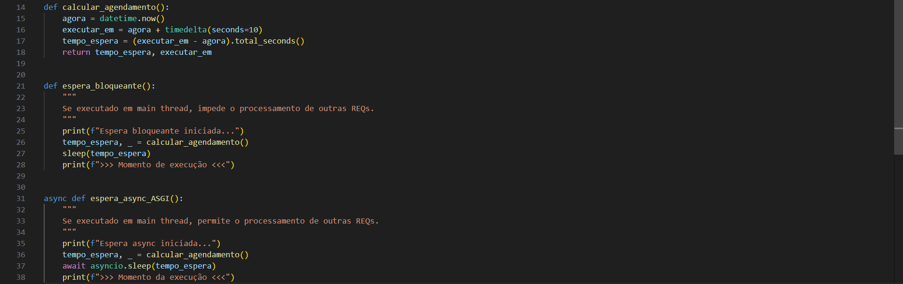
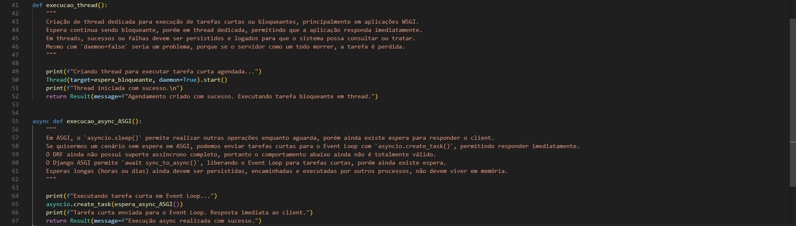
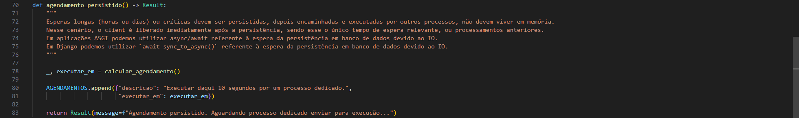
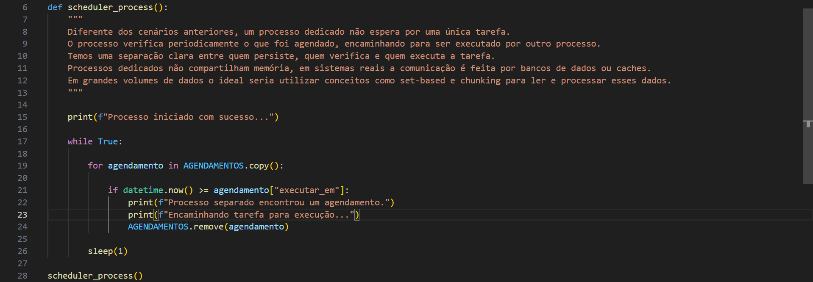

# Scheduling
### Conceitos
- `Scheduling` é o conceito responsável pelo agendamento de tarefas. É o planejamento de uma execução automática em determinado momento ou intervalo de tempo, como um cronômetro para uma execução. O agendamento de tarefas pode acontecer por diferentes propósitos, como enviar um email ou atualizar um volume de dados em determinado horário e dia.

- Essa espera pode ser bloqueante ou não bloqueante, curta ou longa, e ainda pode conter o tempo de execução da tarefa após a espera. Ou seja, temos o tempo de espera e o tempo de execução da tarefa como `dois tempos diferentes`.

- Em aplicações WSGI, idealmente utilizamos `threads` para `esperas curtas e bloqueantes`, enquanto em aplicações ASGI, usamos o `event loop` para `esperas curtas`, e `threads` para `bloqueantes`.

- Com a utilização de `threads` para `execução de tarefas curtas`, também se torna necessário a utilização de algum estado compartilhado, como cache, memória ou banco de dados, `caso seja necessário` a verificação da conclusão ou erros. Por exemplo, algo como `status=pendente`, `status=concluído` ou `status=erro`.

- `Esperas longas` devem ser tratadas com mais cautela, pois não podemos garantir que o processo da aplicação ou o servidor permaneceram em execução durante todo o período de espera. Nesse cenário, a melhor abordagem é `persistir o agendamento` e utilizar um processo dedicado para verificação. Assim, mesmo que a aplicação ou o servidor morram e sejam recriados, a tarefa continuará agendada, será consultada, encaminhada, e executada.

- Um `processo dedicado` seria responsável por "ouvir" agendamentos persistidos que tenham alcançado seu horário de execução, encaminhando para uma fila de execução. O fluxo seria algo como `Tarefa > Persistir > Processo Escuta > Fila Execução`. Nesse cenário, se algo der errado e a tarefa não puder ser concluída, ela continuará armazenada sem que se perca. 

- Agendamentos podem ser executados de maneira única ou recorrente, sendo `removido` após a execução ou sendo `agendado novamente` para um próximo intervalo de tempo. O fluxo seria algo como `Fila Execução > Remoção` ou `Fila Execução > Novo Horário > Persiste > Processo Escuta`.

### Observações
- Esperas longas, como horas ou dias, não devem ser processadas em threads porque criariam múltiplas threads dependendo do volume de requisições. Threads ociosas ocupam recursos do sistema operacional, por esse motivo, é mais interessante `persistir e encaminhar` do que manter na memória de threads ou event loop.

- O tempo de execução da tarefa é diferente do tempo de espera para realizar a tarefa, portanto, se o tempo de execução for alto, é mais interessante `persistir e encaminhar` do que manter em memória de threads ou event loop.

- Utilizar um `processo dedicado` para "ouvir" muitos agendamentos persistidos não é custoso, devido a quantidade limitada de `agendamentos pendentes`. Em cenários de grande escala, técnicas como índices, batch/chunk e particionamento passam a ser importantes.

- A criação de `threads` permite utilizar `daemon=False` para que ela não se perca caso a `aplicação` seja reiniciada, porém seria perdida em caso de reinicialização do `servidor`. Mais uma vez, `esperas ou execuções longas` não devem viver no mesmo processo da aplicação API.

- Processos não compartilham memória, por esse motivo, aplicações em produção utilizam estado compartilhado, como cache ou banco de dados, para conseguirem se comunicar. Nesse laboratório, o processo dedicado não consegue enxergar os agendamentos persistos.

# Imagens

---

---

---

