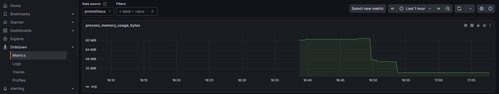
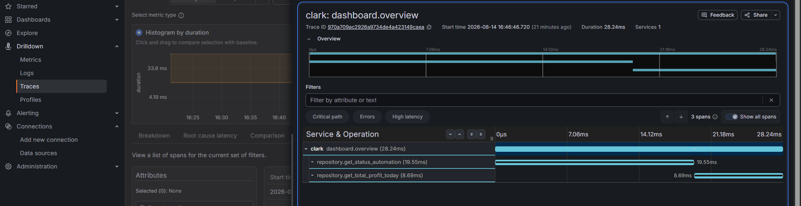
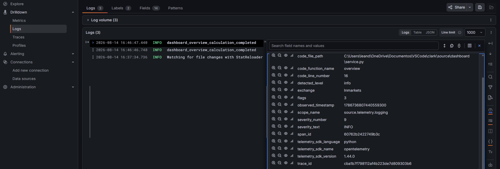

# Telemetria
### Conceitos
- Todo sistema precisa ser observável. Isso significa que olhando de fora, você precisa conseguir enxergar como o sistema funciona. Telemetria é como chamamos tudo o que o sistema produz para observar o sistema, sendo os 3 pilares da telemetria as métricas, logs e traces.

- `Métricas` representam medições quantitativas sobre o estado ou comportamento do sistema ao longo do tempo. Podemos ter `métricas` técnicas como alto consumo de CPU, alto consumo de memória, P95 em 800ms, ou `métricas` de negócio como total de usuários registrados, total de pagamentos faturados.

- `Logs` respondem o que já aconteceu, por exemplo, pagamento efetuado/pagamento agendado, são mensagens claras do que já aconteceu dentro do sistema, devem representar eventos importantes que valem a pena registrar. `Logs` Precisam ser estruturados de maneira clara e conter informações úteis para o negócio e para o desenvolvedor, nos casos de sucesso e principalmente nos casos de falhas. Sempre que um `log` for construído, precisa conter todo o contexto necessário para compreender e investigar o evento o mais rápido possível, geralmente seguindo uma estrutura em formato JSON, com elementos em chave:valor. Podemos incluir dados recebidos pelo usuário, parâmetros dos métodos, dados obtidos do banco, dados de configuração, dados de ambiente e servidores, mas nunca dados sensíveis. Todo `log` produzido dentro de uma operação rastreável deve carregar o contexto de trace, permitindo sua correlação com o trace e seus spans. A integração com OpenTelemetry permite correlacionar `logs` ao contexto de trace, incluindo informações como trace_id e span_id, eliminando a necessidade de adicionar manualmente em cada chamada.

- `Traces` respondem quanto tempo levou e por onde uma requisição passou. De fato foi a parte mais legal do aprendizado até o momento que escrevo isso. A instrumentação do `trace` respeita as fronteiras relevantes da aplicação, por exemplo, chamadas de API, repositórios, filas, etc., tudo o que representa uma fronteira e pode gerar latência. Cada `trace` deve representar uma operação relevante, não deve ser aplicado indiscriminadamente para não gerar poluição visual e ruído desnecessário. Cada operação relevante possui seu próprio `span`, permitindo diferenciar: `REQ Total -> 55.12ms`, `REQ Repository -> 38.01ms`. Isso permite identificar gargalos de maneira cirúrgica, comparar latência entre diferentes operações e entender o caminho percorrido pelas REQs. Para construir traces, utilizamos `spans` que permitem construir não só origem e destino das requisições, como também hierarquia, uma árvore hierárquica das requisições, algo como `API > Service > Repository` ou mais diretamente `API > Repository`. Cada operação relevante percorrida pela requisição pode ser identificada através dos `spans`. Cada `span` representa uma operação, contendo uma descrição e o mais importante: latência. Conseguimos saber exatamente por onde uma requisição está passando e quanto tempo está demorando, permitindo evoluir a aplicação cirurgicamente. Spans são usados como `with tracer.start_as_current_span("camada.método"):` e geralmente ocupam uma linha.

### Como deve ser feito
- Todo o código referente a telemetria/observabilidade é destacável, vivendo em seu próprio módulo, sendo usado pela aplicação como ferramenta, sem poluir serviços ou infraestruturas e inicializados uma única vez no bootstrap da aplicação.

- Cada arquivo, como logging.py, metrics.py, tracing.py, são configurados de maneira independente: logging.py permite exportar o `logger` que é usado para realizar os logs de fato, metrics.py permite `configurar métricas` que serão coletadas e exportadas, tracing.py permite exportar o `tracer` que é usado para a criação e utilização de `spans` que geram rastreabilidade.

- Cada arquivo como collector.yaml, prometheus.yaml e tempo.yaml também são configurados de maneira independente. O `collector.yaml` é responsável por receber, processar e exportar os dados de telemetria para os respectivos backends de armazenamento: Prometheus para as métricas, Tempo para os traces, e Loki para os logs. O `prometheus.yaml` configura como o Prometheus coleta as métricas, incluindo os targets, intervalos de coleta e/ou endpoints de ingestão. O `tempo.yaml` configura a porta, endpoint e também o caminho de armazenamento. Com tudo configurado, usamos o `compose.yaml` para configurar os serviços: Grafana, Prometheus, Loki, Tempo, Collector. Definimos imagens, comando, portas, volumes, etc., e então temos de fato uma aplicação observável.

### Imagens
#### Métricas

---
#### Traces

---
#### Logs

